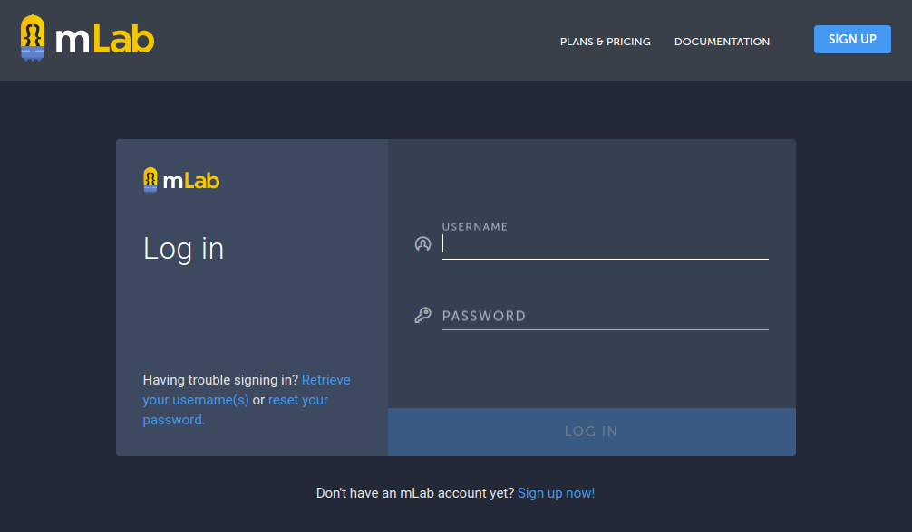

# mLab


**mLab** es un **servicio en la nube que aloja bases de datos MongoDB** y funciona con **plataformas PaaS** como **Amazon**, **Google** y **Microsoft Azure**. PaaS (_Platform as a Service o Plataforma como Servicio_) es una categoría de servicios cloud que proporciona una plataforma y un entorno que permiten a los desarrolladores crear aplicaciones y servicios que funcionen a través de internet.

**MongoDB** es una **base de datos NoSQL orientada a documentos**, libre, de código abierto y una de las más populares debido a lo simple de su configuración, inserción de datos y una estructura flexible que facilita los cambios en el modelo de datos. MongoDB puede ser configurada y lanzada por distintos servicios web como mLab.com.

En este tutorial vamos a ver cómo:

- 1 Crear una nueva cuenta de usuario en mLab
- 2 Acceder a la cuenta de mLab
- 3 Crear una base de datos
- 4 Crear un usuario
- 5 Crear una colección vacía
- 6 Importar/exportar ficheros de datos
- 7 Crear índices

## 1. Crear una nueva cuenta de usuario en mLab

Para crear una nueva cuenta de usuario en mLab hay que comenzar por acceder a su sitio web. En un navegador web visitamos la url:

```
https://mlab.com/
```


Pulsando en el enlace **SIGN UP** se accede al formulario de alta de nueva cuenta de usuario:


Después de rellenar el formulario de alta y pulsar sobre **CREATE ACCOUNT**, se muestra una nueva pantalla que incluye un mensaje en el que se solicita pulsar sobre **Send an email verification** para que mLab envíe un correo de verificación a la cuenta de email que hemos indicado en el formulario de alta:


Tras pulsar sobre el enlace mencionado buscamos en nuestro cliente de email el correo de verificación enviado por mLab, y pulsamos sobre el enlace incluido en el mismo para **confirmar** la creación de la **nueva cuenta**:


A partir de ese momento ya podemos hacer uso de la nueva cuenta de usuario en mLab para crear nuestras bases de datos MongoDB en cloud.

## 2. Acceder a la cuenta de mLab

Para **conectarse a mLab con la cuenta de usuario** recién creada hay que acceder al sitio web de mLab y pulsar en el enlace **LOG IN** de la página principal (ver más arriba).

Se mostrará en pantalla un formulario de login que deberá completarse con el nombre de usuario y la contraseña que se indicaron en el proceso de alta y pulsar sobre el enlace **LOG IN** para enviar:

```
https://mlab.com/
```


Si es la primera vez que accedemos a mLab, o no hemos creado aún ninguna base de datos, se mostrará una pantalla donde elegir entre las opciones **MongoDB Deployments** y **Private Environments**:

- **MongoDB Deployments** permite crear una implementación de MongoDB totalmente administrada en AWS (Amazon), Azure (Microsoft) o Google.

- **Private Environments** permite crear una VPC (red virtual privada en la nube), una red privada, dedicada, definida por software, en la que se puede aprovisionar múltiples implementaciones de MongoDB alojadas en mLab. Este entorno privado permite limitar a redes privadas la comunicación entre aplicaciones y bases de datos. Esta opción solo está disponible para planes dedicados en AWS.


## 3. Crear una base de datos

En este tutorial vamos a crear una implementación de MongoDB gratuita.

Para ello comenzamos por pulsar sobre **Create new** en la sección **MongoDB Deployments** de la pantalla anterior, que desplegará en pantalla sendas listas donde elegir el proveedor de servicios en la nube y el tipo de plan.
- Los proveedores de servicio cloud a elegir son **Amazon**, **Google** y **Azure**.
- Los tipos de  planes: 
    - **SANDBOX** (gratuito): para aprendizaje, desarrollo o prototipado. Hasta 500 Mb. de almacenamiento.
    - **SHARED** (de pago): para pequeñas bases de datos y sistemas en producción con poca carga. Hasta 8 Gb. de almacenamiento.
    - **DEDICATED** (de pago): Para sistemas en producción con flujos según demanda. Incluye escalado vertical y horizontal ilimitado.

En nuestro caso dejaremos **Amazon** como servicio cloud (ya viene preseleccionado), elegiremos **SANDBOX** como plan (gratuito y con 500 Mb. de almacenamiento) y pulsamos sobre **CONTINUE**:


Seleccionamos la Región AWS y pulsamos sobre **CONTINUE**:


Indicamos el nombre de nuestra nueva base de datos (ej.: _mydatabase_) y pulsamos sobre **CONTINUE**:


Confirmamos la selección pulsando sobre **SUBMIT ORDER**:


Con esto terminamos la creación de nuestra nueva base de datos MongoDB en mLab, que podemos comprobar en la lista de la sección MongoDB Deployments:


Pulsando sobre el nombre de despliegue de la base de datos recién creada (_ds129156/mydatabase_) se da paso a una nueva pantalla en la que se muestran dos **formas de conexión a la base de datos**, una mediante el **cliente shell de MongoDB** y otra mediante **driver con URI MongoDB**, además del menú que permite gestionar la base de datos desde esta interfaz con las siguientes opciones:
- **Collections**: gestión de colecciones e índices.
- **Users**: gestión de uuarios.
- **Stats**: estadísticas de uso.
- **Backups**: copias de seguridad.
- **Toools**: herramientas de importación y exportación.


## 4 Crear un usuario

En la pantalla anterior puede verse que la información referente a los modos de conexión con la base de datos hacen referencia a un nombre de usuario y a una contraseña, pero aún no hemos creado ninguno.

```
To connect using the mongo shell:
    mongo ds129156.mlab.com:29156/mydatabase -u <dbuser> -p <dbpassword>

To connect using a driver via the standard MongoDB URI (what's this?):
    mongodb://<dbuser>:<dbpassword>@ds129156.mlab.com:29156/mydatabase
```

El siguiente paso es, por tanto, crear un usuario con el que poder acceder a la base de datos de forma segura.

Para crear un usuario desde el menú del panel de gestión de mLab seleccionamos **Users** y a continuación hacemos click sobre **Add database user**. Se abrirá en pantalla un formulario donde introduciremos los datos del usuario (ej.: _myusr_ y _mypwd_) y finalizaremos pulsando **CREATE**.


El usuario creado aparecerá en la lista de usuarios de la base de datos:


Una vez creado el usuario, podemos acceder desde un terminal de nuestro odenador, si disponemos de un cliente de MongoDB y conexión a Internet, ejecutando el comando indicado en las instrucciones de la pantalla anterior, reemplazando _&lt;dbuser&gt;_ y _&lt;dbpassword&gt;_ por los valores correspondientes:

```
mongo ds129386.mlab.com:29386/mydatabase -u myusr -p mypwd
```


Podemos además interactuar con la base de datos. Por ejemplo, podemos crear una colección con un documento, consultarla y luego eliminarla:

```
# Crear una colección llamada mycollection e insertar un documento
db.mycollection.insert({'name':'Juan', birthday:'May 03', 'profession': 'information technology developer'})

# Mostrar la lista de colecciones en la base de datos
show collections

# Mostrar los documentos de la colección mycollection
db.mycollection.find().pretty()

# Eliminar la colección mycollection
db.mycollection.drop()

# Salir del cliente de mongo
exit
```


## 5. Crear una colección vacía

Para crear una colección desde el menú del panel de gestión de mLab seleccionamos **Collections** y a continuación hacemos click sobre **Add collection**. Se abrirá en pantalla un formulario donde introduciremos el nombre de la coleccion (ej.: _mycollection_) y finalizaremos pulsando **CREATE**.


La colección creada, que carece aún de estructura y de datos, aparecerá en la lista de colecciones de la base de datos:


## 6. Importar/exportar ficheros de datos

En la opción **Tools** del menú del panel de gestión principal de mLab se muestran instrucciones que permiten **importar** ficheros de datos en colecciones MongoDB (por consola, mediante un cliente mongo), y **exportar** colecciones de datos MongoDB a ficheros. El formato de estos ficheros puede ser de tipo **JSON**, **CSV** y **Binary** (_dumps_).


Operaciones **import/export** para ficheros en formato **JSON**:

```
# Import collection
mongoimport -h ds129386.mlab.com:29386 -d mydatabase -c <collection> -u <user> -p <password> --file <input file>

# Export collection
mongoexport -h ds129386.mlab.com:29386 -d mydatabase -c <collection> -u <user> -p <password> -o <output file>
```

Operaciones **import/export** para ficheros en formato **CSV**:

```
# Import collection
mongoimport -h ds129386.mlab.com:29386 -d mydatabase -c <collection> -u <user> -p <password> --file <input .csv file> --type csv --headerline

# Export collection
mongoexport -h ds129386.mlab.com:29386 -d mydatabase -c <collection> -u <user> -p <password> -o <output .csv file> --csv -f <comma-separated list of field names>
```

Operaciones **import/export** para ficheros en formato **Binary**:

```
# Import database
mongorestore -h ds129386.mlab.com:29386 -d mydatabase -u <user> -p <password> <input db directory>

# Export database
mongodump -h ds129386.mlab.com:29386 -d mydatabase -u <user> -p <password> -o <output directory>

# Import collection
mongorestore -h ds129386.mlab.com:29386 -d mydatabase -u <user> -p <password> <input .bson file>

# Export collection
mongodump -h ds129386.mlab.com:29386 -d mydatabase -c <collection> -u <user> -p <password> -o <output directory>

```

Como ejemplo, abriendo un terminal en nuestro ordenador, con el cliente mongo que tengamos instalado, vamos a importar en la base de datos creada en mLab un fichero en formato JSON con información sobre restaurantes de New York:

```
mongoimport -h ds129386.mlab.com:29386 -d mydatabase -c restaurants -u myusr -p mypwd --file ./restaurants-data.json
```
La salida por consola es la siguiente:


Desde el panel de gestión de mLab podemos ver la nueva colección de restaurantes de New York:


y pulsando sobre ella podemos ver su contenido:


También podemos acceder a la colección de restaurantes abriendo un terminal en nuestro ordenador y estableciendo conexión con la base de datos en mLab:


## 7 Crear índices

Para ilustrar la creación de índices sobre colecciones de bases de datos MongoDB creadas en mLab crearemos un índice en la colección **restaurants** que cargamos anteriormente, sobre la propiedad **cuisine** presente en los documentos de dicha colección.

Para ello, en el panel de gestión de mLab, accedemos a la lista de colecciones, seleccionamos la de **restaurants** y pulsamos sobre la opción **Indexes** del menú. Veremos en pantalla el índice que se crea por defecto en toda colección sobre la propiedad **_id**.


Para añadir nuestro nuevo índice pulsamos sobre el enlace **Add index**, que mostrará una ventana donde poder configurarlo. Después pulsamos sobre **CREATE IN BACKGROUND** y, al momento, podremos ver el nuevo índice en la lista de índices de la colección:


## Referencias y más información

- [mLab](https://mlab.com/)
- [Tutorial de Creación de una Base de Datos MongoDB con mLab](http://gidahatari.com/ih-es/tutorial-de-creacion-de-una-base-de-datos-mongodb-con-mlab)
- [mLab (wikipedia)](https://en.wikipedia.org/wiki/MLab)

